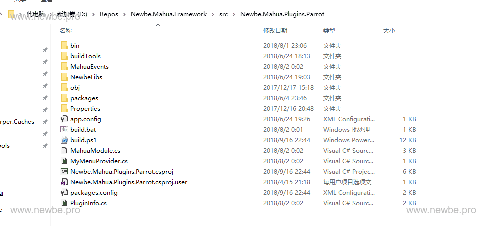
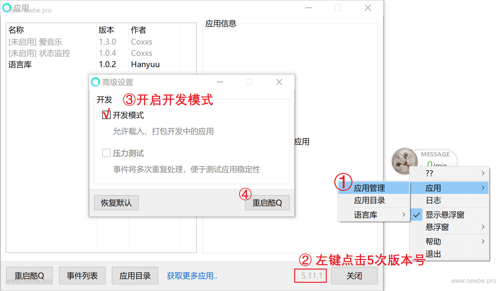

# i春秋社区机器人
[](#contributors-)
[](https://github.com/0nise/ichunqiu_qqbot/stargazers) 
[](https://github.com/0nise/ichunqiu_qqbot/blob/master/LICENSE)

> i春秋社区机器人自`2018年02月04日`开始服务于i春秋社区，每日文章推送、文章查询、魔法币查询、作者信息查询、作家团奖金余额查询、奖金排行榜、i春秋课程查询等一列功能。据不完全统计，使用人数已经超过`3.5万`，使用次数达到`20万`，最大覆盖`700+`个群。

> 自`2019年6月13日`起i春秋社区机器人与i春秋社区相关的功能全部关闭，i春秋社区机器人宣布正式开源，非常感谢对i春秋社区机器人的支持。同时i春秋社区机器人正式更名为`Alpha机器人`，对于新的机器人正在构思中，有想法、建议的可以提交到[Issues](https://github.com/0nise/ichunqiu_qqbot/issues)中，非常感谢。

- 非常感谢期间的运维[NS-Sp4ce](https://github.com/NS-Sp4ce)。

- 非常感谢提出各种需求坏蛋。

- 非常感谢王八蛋[newbe36524](https://github.com/newbe36524/)的[Newbe.Mahua.Framework](https://github.com/newbe36524/Newbe.Mahua.Framework)框架的支持。

- 非常感谢[CoolQ](https://github.com/CoolQ)的支持。

- 非常感谢提交第一个漏洞的[gh0stkey](https://github.com/gh0stkey)。

- ......

## 功能指令

### 文章相关

```
随机文章 --> 随机回复文章
最新文章 --> 回复最新文章
作者随机 --> 指定作者随机回复文章
作者最新 --> 回复作者最新文章
```

### 课程相关

```
随机教程 --> i春秋首页随机课程
最新教程 --> i春秋首页最新课程
今日最新 --> i春秋首页课程1条和4条最新文章
```

### 群推送相关

```
发布 --> 发布推送信息（管理员权限）
艾特全体 --> 发布推送信息（艾特全体推送）（管理员权限）
```

### i春秋作家团相关

```
查询余额 --> 查询i春秋作家团余额（自己）
提现记录 --> i春秋作家团成员提现记录
财富榜 --> i春秋作家团奖金排行
我的信息 --> i春秋作家团用户信息
加钱 --> i春秋作家团指定用户添加奖金（管理员权限）
提现 --> i春秋作家团发起体现
```

### 统计相关

```
今日使用 --> 今日使用机器人次数（管理员权限）
总人数 --> 使用机器人次数（管理员权限）
7日使用 --> 一周内使用机器人情况（管理员权限）
群数 --> 机器人覆盖群数量（管理员权限）
```

### 帮助相关

```
help --> 指令信息
指令 --> 指令信息
关于我 --> 关于我
```

## 开发环境

操作系统：Windows 10

开发语言：CSharp

数据库：MySQL5.7

运行平台：[酷Q Pro](https://cqp.cc/t/14901)

开发工具：Visual Studio 2019

.NET版本：4.5.2

开发框架：基于王八蛋[newbe36524](https://github.com/newbe36524/)的[Newbe.Mahua.Framework](https://github.com/newbe36524/Newbe.Mahua.Framework)框架开发

Newbe.Mahua.Framework：[https://github.com/newbe36524/Newbe.Mahua.Framework](https://github.com/newbe36524/Newbe.Mahua.Framework)

## 运行

### 编译

运行`Newbe.Mahua.Plugins.iChunqiuQQBot/Newbe.Mahua.Plugins.iChunqiuQQBoot.Beta`目录中的`build.bat`文件进行编译
```
build.bat
```
### CoolQ运行

在`Newbe.Mahua.Plugins.iChunqiuQQBot/Newbe.Mahua.Plugins.iChunqiuQQBoot.Beta/bin`目录下会按照当前安装的平台生成相应的目录。本示例将会生成 CQP、Amanda 和 MPQ 三个目录。

分别将三个文件夹下的所有文件和文件夹都复制到对应的机器人平台根目录。

以 CQP 为例，进行一次复制过程如下图所示：



各机器人软件下载地址：

|名称|地址|
|:-:|:-:|
|CQP|https://cqp.cc/|
|MPQ|https://f.mypcqq.cc/thread-2327-1-1.html|
|CleverQQ|https://d.cleverqq.cn/forum.php|
|QQLight|http://www.52chat.cc/|

### 启用插件

各个机器人平台的启用方式各不相同。

#### CQP
按照下图所示，开启开发者模式。



打开插件管理将插件启用。

#### CleverQQ
打开插件管理将插件启用。

#### MPQ
打开插件管理将插件启用。

#### QQLight
打开插件管理将插件启用。

### 成功！

发送消息给机器人，你就会收到机器人回发的信息。


> 机器人插件启动可能需要一段时间，并且大多数平台都会丢弃离线信息，可能需要等待一会儿在发送。

### 问题

[Newbe.Mahua CQP 紧急故障修复](http://www.newbe.pro/2019/05/05/Newbe.Mahua/Newbe-Mahua-CQP-Hotfix/)

## 效果

### 最新文章指令


### 关于我指令


## 群数量指令


## 文件简介

```
├─images 图片资源
├─Newbe.Mahua.Plugins.iChunqiuQQBot i春秋社区机器人源代码
├─script i春秋爬虫脚本
│  ├─spider_ichunqiu.py 爬虫i春秋全部社区文章
│  ├─spider_ichunqiu_class.py 爬虫i春秋课程信息
│  ├─spider_ichunqiu_ext.py 定时爬虫i春秋社区文章，只爬虫每个板块的第一页
│  ├─ThreadPool.py 线程池
│  └─update_content.py 定时更新数据数据库与论坛内容保持同步
└─sql i春秋社区机器人数据库设计结构
```
## Contributors
<!-- ALL-CONTRIBUTORS-LIST:START - Do not remove or modify this section -->
<!-- prettier-ignore-start -->
<!-- markdownlint-disable -->
<table>
  <tr>
    <td align="center"><a href="http://www.r4v3zn.com"><br /><sub><b>r4v3zn</b></sub></a><br /><a href="https://github.com/0nise/ichunqiu_qqbot/commits?author=0nise" title="Documentation">📖</a> <a href="https://github.com/0nise/ichunqiu_qqbot/commits?author=0nise" title="Code">💻</a> <a href="#eventOrganizing-0nise" title="Event Organizing">📋</a> <a href="#projectManagement-0nise" title="Project Management">📆</a> <a href="#tutorial-0nise" title="Tutorials">✅</a></td>
    <td align="center"><a href="https://0x20h.com"><br /><sub><b>Sp4ce</b></sub></a><br /><a href="#maintenance-NS-Sp4ce" title="Maintenance">🚧</a></td>
  </tr>
</table>

<!-- markdownlint-enable -->
<!-- prettier-ignore-end -->
<!-- ALL-CONTRIBUTORS-LIST:END -->

## 程序更新日志

2019.06.19

    - i春秋社区机器人正式开源

...... 

    - 我也忘了我改了多少次了

2018.5.21

    - 修改一些细微的BUG

2018.3.13

    - 添加定时爬虫i春秋社区文章信息

2018.3.9

    - 更新爬虫社区类别以及子类信息

2018.3.1

    - 添加爬虫ｉ春秋课程的脚本

2018.2.4

    - 修复机器人ＳＱＬ注入漏洞

## 相关文章

https://bbs.ichunqiu.com/thread-34956-1-1.html

https://bbs.ichunqiu.com/thread-33770-1-1.html

## Contributors ✨

Thanks goes to these wonderful people ([emoji key](https://allcontributors.org/docs/en/emoji-key)):

<!-- ALL-CONTRIBUTORS-LIST:START - Do not remove or modify this section -->
<!-- prettier-ignore-start -->
<!-- markdownlint-disable -->
<!-- markdownlint-enable -->
<!-- prettier-ignore-end -->
<!-- ALL-CONTRIBUTORS-LIST:END -->

This project follows the [all-contributors](https://github.com/all-contributors/all-contributors) specification. Contributions of any kind welcome!
